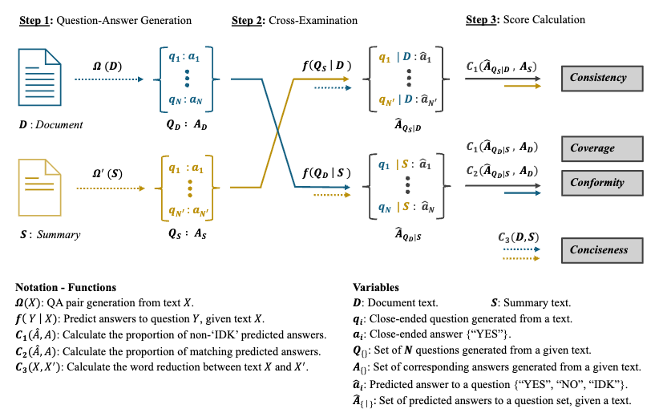

# MEDIC: Cross-Examination Framework

The Cross-Examination Framework is a Python API designed to evaluate the performance of LLMs in clinical generation tasks such as summarization, clinical and SOAP note generation. It is integrated into the broader MEDIC evaluation framework. ([Preprint](https://arxiv.org/abs/2409.07314), [🤗 leaderboard](https://huggingface.co/spaces/m42-health/MEDIC-Benchmark)).




## System Requirements

The Cross-Examination Framework is a Python application that is designed to run on a standard computer even without a GPU. It requires internet access to the OpenAI compatible LLM API or a LLM server running on device.
The application has been successfully tested on the following hardware configurations:

- Macbook Pro with M2 Pro chip and 16GB unified memory
- Linux system with Intel Xeon processor, 128GB RAM, and 1x H100 / H200 GPU

## Installation

```
# Clone the repository
git clone https://github.com/m42-health/cross-examination-framework.git
cd cross-examination-framework

# Create conda environment and install dependencies
# Installation shoud take under 60 seconds on a Macbook
conda env create -f environment.yml

# Activate conda environment
conda activate cross-examination-framework
``` 

## Usage

The Cross-Examination Framework provides a RESTful API that can be used to evaluate the performance of LLMs in clinical generation tasks.

Parameters controlling the API are defined in the `pipeline_params.yaml` file. You should change the base_endpoint and the llm_models to the endpoint of the LLM API you want to use to generate the questions and run the cross-examination.

Prompts are defined in the `prompts.yaml` file. You can add or modify the prompts to fit your needs.

```
# Run the application
gunicorn main:app -w 1 -k uvicorn.workers.UvicornWorker --bind 0.0.0.0:8893
```


## Example API call

For example, to run the cross-examination framework on an original document and its corresponding SOAP note, using OpenAI GPT4o-mini as a cross-examinator (as defined in `pipeline_params.yaml`). You can run the following command

```
curl -X POST \
  -H "Content-Type: application/json" \
  -d '{
    "original_document": "Patient is a 65-year-old male with a history of hypertension and type 2 diabetes presenting with chest pain that started 2 hours ago. Pain is described as crushing, substernal, radiating to the left arm. EKG shows ST elevation in leads V2-V5. Troponin levels are elevated. Assessment: Acute ST-elevation myocardial infarction (STEMI). Plan: Emergent cardiac catheterization.",
    "generated_document": "SOAP Note:\nS: 65M with HTN, DM2 presents with 2hr hx of crushing substernal chest pain radiating to L arm.\nO: EKG: ST elevation V2-V5. Trop elevated.\nA: Acute STEMI.\nP: Urgent cardiac cath."
  }' \
  http://0.0.0.0:8893/evaluate
```
### Expected output
<details>
<summary><i>Expected response from the API call above</i></summary>

```json
{
    "scores": {
        "coverage_score": 1.0,
        "conformity_score": 1.0,
        "consistency_score": 1.0,
        "conciseness_score": 31.343283582089555,
        "overall_score": 1.0
    },
    "details": {
        "qa_from_doc_count": 10,
        "qa_from_summary_count": 5,
        "questions_from_original_doc": [
            {
                "question": "Is the patient a 65-year-old male?",
                "answer": "YES"
            },
            {
                "question": "Does the patient have a history of hypertension?",
                "answer": "YES"
            },
            {
                "question": "Is the patient diagnosed with type 2 diabetes?",
                "answer": "YES"
            },
            {
                "question": "Did the chest pain start 2 hours ago?",
                "answer": "YES"
            },
            {
                "question": "Is the chest pain described as crushing and substernal?",
                "answer": "YES"
            },
            {
                "question": "Does the pain radiate to the left arm?",
                "answer": "YES"
            },
            {
                "question": "Does the EKG show ST elevation in leads V2-V5?",
                "answer": "YES"
            },
            {
                "question": "Are troponin levels elevated?",
                "answer": "YES"
            },
            {
                "question": "Is the assessment of the patient acute ST-elevation myocardial infarction (STEMI)?",
                "answer": "YES"
            },
            {
                "question": "Is the plan for the patient emergent cardiac catheterization?",
                "answer": "YES"
            }
        ],
        "questions_from_generated_doc": [
            {
                "question": "Does the patient have a history of hypertension?",
                "answer": "YES"
            },
            {
                "question": "Is the patient's chest pain described as crushing?",
                "answer": "YES"
            },
            {
                "question": "Does the EKG show ST elevation in leads V2-V5?",
                "answer": "YES"
            },
            {
                "question": "Is the diagnosis of the patient acute STEMI?",
                "answer": "YES"
            },
            {
                "question": "Is an urgent cardiac catheterization planned for the patient?",
                "answer": "YES"
            }
        ]
    }
}
```
</details>

## Scores

This will return the following scores:
- Coverage: Measures how thoroughly the summary covers the original document. A higher score means the summary includes more details from the original.
- Conformity: Also called the non-contradiction score, this checks if the summary avoids contradicting the original document. A higher score means the summary aligns better with the original.
- Consistency: Measures the level of non-hallucination, or how much the summary sticks to the facts in the document. A higher score means the summary is more factual and accurate.
- Conciseness: Measures how brief the summary is. A higher score means the summary is more concise. A negative score means the summary is longer than the original document.
- Overall Score: The average of coverage, conformity, consistency.


## License

This project is licensed under CC BY-NC-4.0 - see the [LICENSE.md](LICENSE.md) file for details.

## Contribution

Contributions are welcome! Please feel free to submit a Pull Request. 

## Citation

If you find this repository useful, please consider giving a star and citation:
```
@article{kanithi2024medic,
  title={Medic: Towards a comprehensive framework for evaluating llms in clinical applications},
  author={Kanithi, Praveen K and Christophe, Cl{\'e}ment and Pimentel, Marco AF and Raha, Tathagata and Saadi, Nada and Javed, Hamza and Maslenkova, Svetlana and Hayat, Nasir and Rajan, Ronnie and Khan, Shadab},
  journal={arXiv preprint arXiv:2409.07314},
  year={2024}
}
```
